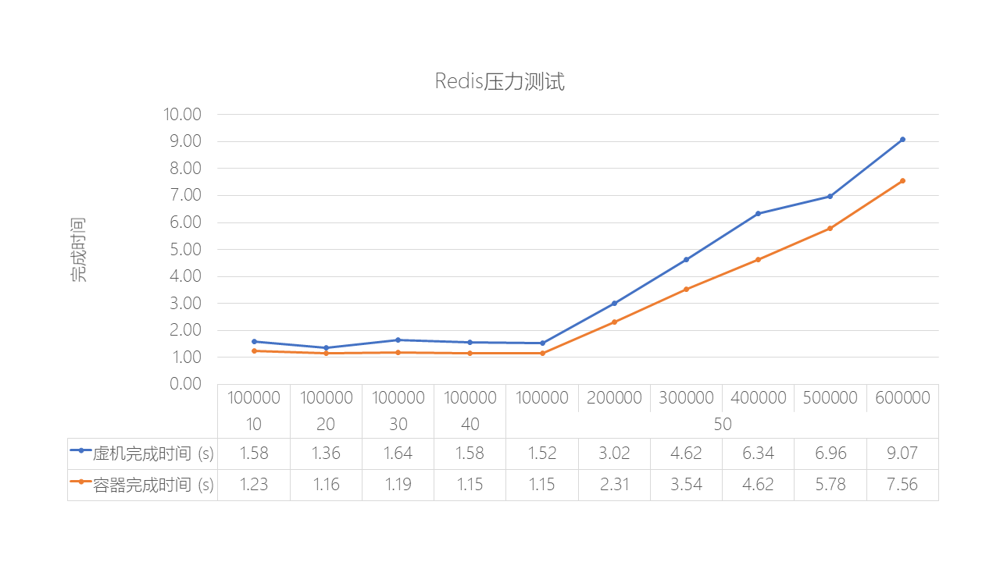

# 2. 静态服务能耗比较
这部分主要比较在传统虚拟机环境和云原生容器环境下应用服务的完成同样任务时的效率和资源消耗。

虚拟机技术是一种通过软件模拟完整的硬件系统功能的计算机系统，它运行在一个完全隔离的环境中。当我们创建虚拟机时，需要将物理环境中的存储和内存容量作为虚拟机的存储和内存容量，每个虚拟机都有着独立的CMOS、计算（CPU/内存）、网络、存储和操作系统，可以像使用物理机一样对虚拟机进行操作。

虚拟机管理程序允许多个租户将孤立的虚拟机部署在同一台物理机器上，实现了共享硬件基础架构。虚拟机模拟了计算机体系结构的计算机系统，并提供了物理计算机的功能。这种技术大大提高了底层物理机器的利用率。相比之下，云原生容器技术是在内核层对资源进行共享，由kernel对容器进程进行资源分配，无论是效率和能耗都比虚拟机要好很多。

例如，使用KVM的Hypervisor层报告开销介于9-12％之间，这意味着KVM下的客户机操作系统通常从可用CPU的88-91％开始。当在Hyper-V下运行的操作系统被观察到在主存储器的大约90%时，存储器无法再进行申请或者出现内存溢出错误。当然，在客户操作系统上运行进程可能会因缺乏资源而受到影响，并且效率低于直接在主机（物理服务器）操作系统上运行相同进程的效率。

考虑到这种虚拟化开销，容器的工作方式及其好处是直接在主机上运行容器的重要原因。

容器为虚拟机（VM）提供了一种轻量级的代替方案。容器可以将您的应用程序隔离在其自己的运行环境中，无论它在何处运行。与虚拟机不同，容器只会安装应用程序所需的依赖项，而不会添加任何其他东西。容器使开发人员能够在相同的开发环境和堆栈中工作，并能够在容器中进行开发，而无需构建和运行虚拟机，因为它提供了独立的网络堆栈和存储。此外，容器有助于持续集成和交付流程，并鼓励无状态设计。总而言之，容器比虚拟机更加灵活、高效和节约资源。

虚拟机也可以使用和容器一样的方式，但它们存在着几个明显的缺点。最主要的是，虚拟化需要经过中间层（Hypervisor）进行转换，这会带来一定的开销。无论部署的guest虚拟机操作系统（OS）有多精简，每次创建新的虚拟机时都需要完全复制整个操作系统及其配置，这会导致虚拟机性能相对较低。容器则在虚拟机或裸机主机操作系统之上运行自身的初始化进程、文件系统和网络堆栈，因此在原理上使用的内存要比虚拟机少。这是因为容器之间原生的会共享OS内核，并且通常使用相同的库。

本文比较了四种静态场景下采用云原生容器和传统虚拟机的方式所占用的资源和能耗（执行速度越快相对能耗就会越低）：

|                 | **静态存储占用** | **执行效率**  |         **(能耗)**         |
| --------------- | ---------------- | ---------------------- | ---------------- |
|                 | **虚拟机**       | **容器**               | **容器比虚拟机** |
| 标准压缩        | 1.5G             | 359M                   | 快18%            |
| Redis内存数据库 | 2.0G             | 117M                   | 快29%            |
| Nginx代理服务   | 4.5G             | 142M                   | 快46%            |
| Tomcat Web服务  | 3.3G             | 142M                   | 快14%            |

## 2.1.  标准压缩测试

压缩是云计算工作负载中经常使用的组件。PXZ是一个使用LZMA算法的并行无损数据压缩实用程序。使用PXZ 4.999.9beta (build 20130528)来压缩enwik9，这是一个1GB的Wikipedia转储文件，经常用于压缩基准测试。为了专注于压缩而不是I/O，测试使用了24个线程，输入文件缓存在RAM中，输出通过管道传输到/dev/null。这里使用压缩级别2。

|              | **虚拟机镜像** | **容器镜像** |
| ------------ | -------------- | ------------ |
| 静态大小     | 1.5G           | 359M         |
| 内存/CPU限制 | 128G/24 core   | 128/24 core  |

在10次压缩测试后， docker容器的表现要比KVM虚拟机快18%。

[原始数据](File_Compress_Test_Raw_Data.md)

## 2.2.  Redis数据库测试

基于内存的Redis键值存储通常在云中用于缓存、存储会话信息，并作为维护非结构化热数据集的方便方法。操作本质上很简单，数据需要在客户机和服务器之间进行网络往返。这种使用模型使得应用程序通常对网络延迟非常敏感。考虑到大量的并发客户端，每个客户端向许多服务器发送非常小的网络数据包，这一挑战变得更加复杂。因此，Redis服务将会在网络堆栈中花费了相当多的资源。这里采用redis-benchmark来模拟客户端进行压力测试，是Redis自带的测试工具，可模拟N个客户端同时发出M个请求。

|              | **虚拟机镜像**  | **容器镜像** |
| ------------ | --------------- | ------------ |
| 静态大小     | 50G（占用2.0G） | 117M         |
| 内存/CPU限制 | 128G/24 core    | 128/24 core  |

在测试的10种场景里采用容器比采用虚拟机的方式平均快29%，也就意味着能耗的下降。

原始数据

## 2.3.  Nginx服务测试

Nginx是一款轻量级的高性能的Web服务器和反向代理服务器，可以处理大量并发连接和高流量负载。Nginx在设计上采用了事件驱动的异步I/O模型，这使得它能够在处理请求时更加高效地利用系统资源，同时也能够更好地处理高并发请求。因为Nginx本身占用资源很少，可以模拟更加真实的负载对资源的消耗情况。

这里采用Apache Bench (ab)对不同场景下的Nginx服务进行测试。AB是一个命令行工具，用于基准测试web服务器的性能。它向web服务器发送大量请求，并测量响应时间和其他统计数据。

|              | **虚拟机镜像**  | **容器镜像** |
| ------------ | --------------- | ------------ |
| 静态大小     | 50G（占用4.5G） | 142M         |
| 内存/CPU限制 | 128G/24 core    | 128/24 core  |

在测试的10种场景里采用容器比采用虚拟机的方式平均快46%，同时意味着能耗的下降。

原始数据

## 2.4.  Tomcat服务测试

Tomcat是一个典型的开源Web服务器和Java Servlet容器，用于托管Java Web应用程序。它的开源性、轻量级、简单易用性、可扩展性、高性能和跨平台性以及庞大的社区支持使它成为被广泛使用的Java Web应用服务器之一。

这里同样采用Apache Bench对Tomcat进行性能测试。

|              | **虚拟机镜像**  | **容器镜像** |
| ------------ | --------------- | ------------ |
| 静态大小     | 100G (占用3.3G) | 142M         |
| 内存/CPU限制 | 128G/24 core    | 128/24 core  |

在测试的10种场景里采用容器比采用虚拟机的方式平均快14%，同时意味着能耗的下降。

原始数据
