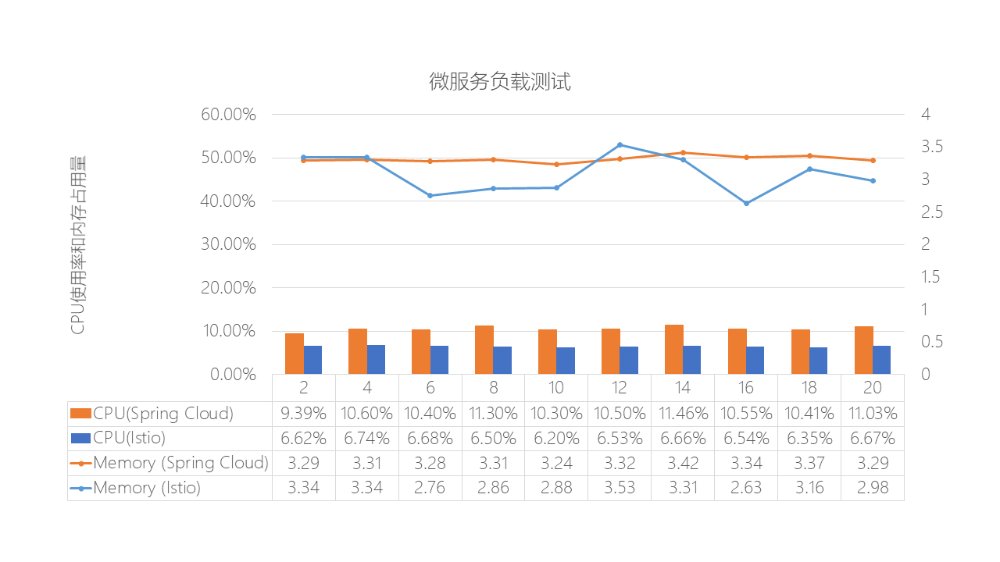
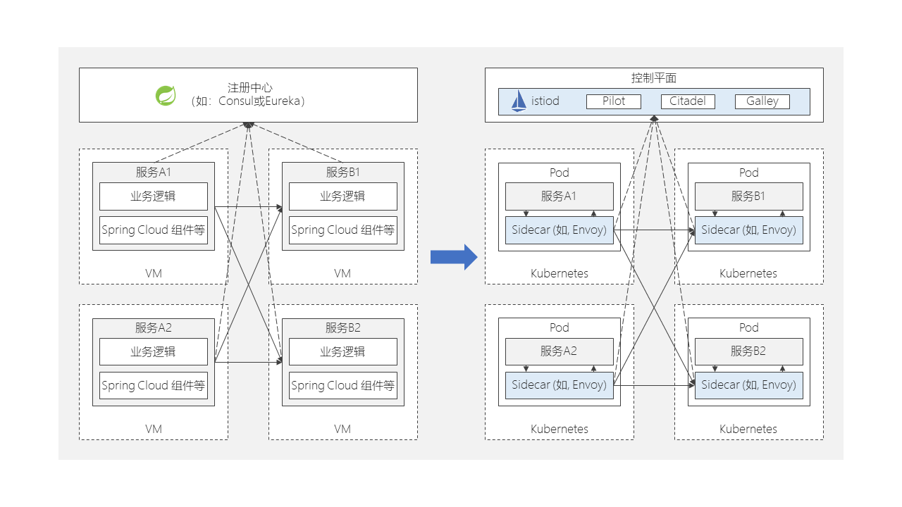

# 3. 微服务框架能耗比较

选取spring cloud和istio两种微服务框架。比较他们在标准状态下的资源消耗，压力测试结果。

测试环境:

|              | **虚拟机镜像** | **容器镜像** |
| ------------ | -------------- | ------------ |
| 静态大小     | 200G (占用78G) | 642M         |
| 内存/CPU限制 | 16G/4 core     | 16G/4 core   |

 

测试的方法是采用Jmeter模拟负载，50并发持续20分钟，采集系统的负载信息。

从测试结果看CPU负载在云原生场景（Istio）下平均节省38%的CPU资源，内存低约7%。

[原始数据](istio_vs_spring_compare_20220915.md)

 

以下是不同微服务架构的功能差别，几乎所有的云原生微服务功能都包含在Istio控件中，不需要额外引入组件实现，更轻量，更节能。

| **功能列表**                   | **描述**                                                     | **Spring Cloud**                                             | **Istio+Kubernetes**   **(云原生解决方案)**                  |
| ------------------------------ | ------------------------------------------------------------ | ------------------------------------------------------------ | ------------------------------------------------------------ |
| 服务注册与发现                 | 在部署应用时，会自动进行服务的注册，其他调用方可以即时获取新服务的注册信息 | 支持，基于Eureka、Consul等组件实现，提供server和client管理   | 支持                                                         |
| 配置中心                       | 可以管理微服务的配置                                         | 支持，基于spring  cloud config组件实现                       | 支持                                                         |
| Namespace隔离                  | 基于Namespace隔离微服务                                      | 依赖PaaS云服务实现                                           | 支持                                                         |
| 微服务间路由管理               | 实现微服务之间相互访  问的管理                               | 基于网关Zuul实现，需 要代码级别配置                          | 基于声明配置文件，最终转化成路由规则实现，Istio VIrtual  Service和Destination Rule |
| 负载均衡                       | 客户端发起请求在微服务端的负载均衡                           | Ribbon或Feigin                                               | Envoy，基于声明配置 文件，最终转化成路由 规则实现            |
| 应用日志收集                   | 收集微服务的日志                                             | 支持，提供Client对接第三方日志系统                           | 支持对接EFK                                                  |
| 对外访问API网关                | 为所有客户端请求的入☐                                        | 基于Zuul或Spring-CLoud-gateway实现                           | 基于Ingress网关和Egress网关实现出入管理                      |
| 链路追踪                       | 可以生成微服务之间调  用的拓扑关系图                         | 基于Zipkin实现                                               | 基于Istio自带的Jaeger 实现，并通过kiali展示                  |
| 无源码修改方式                 | 将应用迁移到微服务架  构时不修改应用源代码                   | 不支持                                                       | 必须依赖PaaS实现，在 部署的容器化应用时进 行sidecar注入      |
| 灰度、蓝绿发布                 | 实现应用版本的动态切  换                                     | 需要修改代码实现                                             | Envoy，基于声明配置文件，最终转化成路由规则实现              |
| 灰度上线                       | 允许上线实时流量的副本，客户无感知                           | 不支持                                                       | Envoy，基于声明配置文件，最终转化成路由规则实现              |
| 安全策略                       | 实现微服务访问控制的支持RBAC，对于微服务入口流量可以设置加密访问 | 基于Spring  Security组件实现，包括认证，鉴权等，支持通信加密 | Istio的认证和授权                                            |
| 性能监控                       | 监控微服务的实时性能                                         | 支持，基于Spring  Cloud提供的监控组件收集数据，对接第三方的监控数据存储 | 基于Istio自带的Prometheus和Grafana实现                       |
| 故障注入                       | 模拟微服务的故障，增加可用性                                 | 不支持                                                       | 支持退出和延迟两类故障注入                                   |
| 服务间调用限流、熔断           | 避免微服务出现雪崩                                           | 基于Hystrix实现，需要 代码注释                               | Envoy，基于声明配置 文件，最终转化成路由 规则实现            |
| 实现微服务间的访问控制黑白名单 | 灵活设置微服务之间的相互访问策略                             | 需要代码注释                                                 | Envoy，基于声明配置 文件，最终转化成路由 规则实现            |
| 服务间路由控制                 | 灵活设置微服务之间的相互访问策略                             | 需要代码注释                                                 | Envoy，基于声明配置 文件，最终转化成路由 规则实现            |
| 对外部应用的访问               | 微服务内的应用可以访问微服务体系外的应用                     | 需要代码注释                                                 | ServiceEntry                                                 |
| 链路访问数据可视化             | 实时追踪微服务之间访问的链路，包括流量、成功率等             | 不支持                                                       | 基于Istio自带的Kiali 实现                                    |

Spring Cloud 作为开源届大佬 Spring 旗下微服务框架的代表作，天生强大。在不断地吸收整个Java业界的优秀方案的同时，还引入了 Netflix 较完备、成熟的微服务治理工具集，诸如 Eureka、Ribbon、Hystrix、Config、Archaius、Zuul，当然现在还有 Alibaba。

Spring Cloud是一系列框架的有序集合。它利用Spring Boot的开发便利性巧妙地简化了分布式系统基础设施的开发，如服务发现注册、配置中心、消息总线、负载均衡、断路器、数据监控等，都可以用Spring Boot的开发风格做到一键启动和部署。Spring Cloud并没有重复制造轮子，它只是将各家公司开发的比较成熟、经得起实际考验的服务框架组合起来，通过Spring Boot风格进行再封装屏蔽掉了复杂的配置和实现原理，最终给开发者留出了一套简单易懂、易部署和易维护的分布式系统开发工具包。

Istio 的理论概念是 Service Mesh（服务网络），实际上是微服务的一种落地形式（SideCar模式），它的主要思想是关注点分离，即不像 SpringCloud 一样交给研发来做，也不集成到 kubernetes中产生职责混乱，Istio是通过为服务配 Agent 代理来提供服务发现、负截均衡、限流、链路跟踪、鉴权等微服务治理手段。

Istio被引入的主要原因是传统微服务存在以下问题。

·    **多语言技术栈不统一：**C++、Java、PHP、Go。Spring Cloud无法提出非Java语言的微服务治理。

·    **服务治理周期长：**微服务治理框架与业务耦合，上线周期长，策略调整周期长。

·    **产品能力弱：**Spring Cloud缺乏平台化和产品化的能力，可视化能力弱。

Istio 开始就是与云原生结合设计的， Istio 超越 spring cloud 和 dubbo 等传统开发框架之处, 就在于不仅仅带来了远超这些框架所能提供的功能, 而且也不需要应用程序为此做大量的改动, 开发人员也不必为上面的功能实现进行大量的知识储备.

以往使用 Spring Cloud ，基于一个 Agent 插入业务运行时的模式，使得我们在更新Agent的时候，需要通知各个业务更新这个 Agent 对应的版本，而业务又会担心 Agent 版本更新造成不好的影响，升级过程比较复杂。Service Mesh 则通过 SideCar 的方式，将控制面和数据面隔离，通过非侵入的模式进行流量拦截，在实现真正的治理平台化的同时，也解决了多语言共存的问题——使用不同编程语言开发的服务节点，只需要与本地的 SideCar 行通信。

